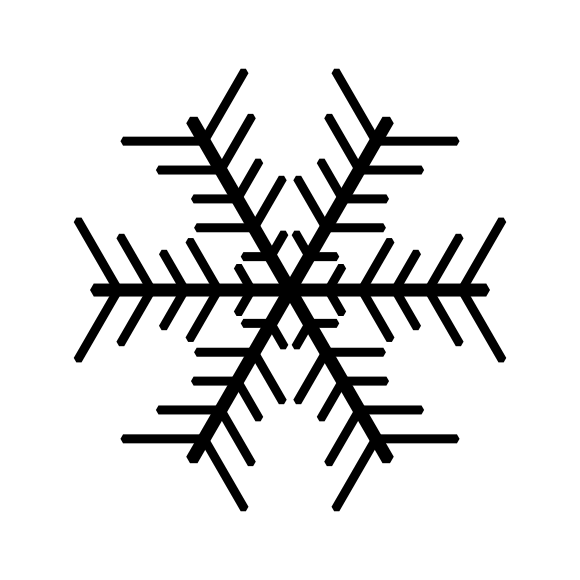

# Snowflake SVG Generator

I built this project over the holiday to generate random snowflake svg's for a friend who was planning to have sheets of them lasercut.

## Examples

### Default script ###
Default script generates 20 unique snowflakes svg files.  This has been made into the following animated gif for illustration.

### Non-sixfold symmetries

The program has partial support for making snowflakes of other (incorrect) symmetries, however the arrow-shaped tip calculations are not quite correct on the side arms of the 'snowflakes'.

Heptagonal:

Twenty-fold perhaps looks too much like a virus:

## UI

User interface to the script is non-existent, see script edit `if __name__ == '__main__'` for basic overriding of parameters.  Good luck and have fun.
